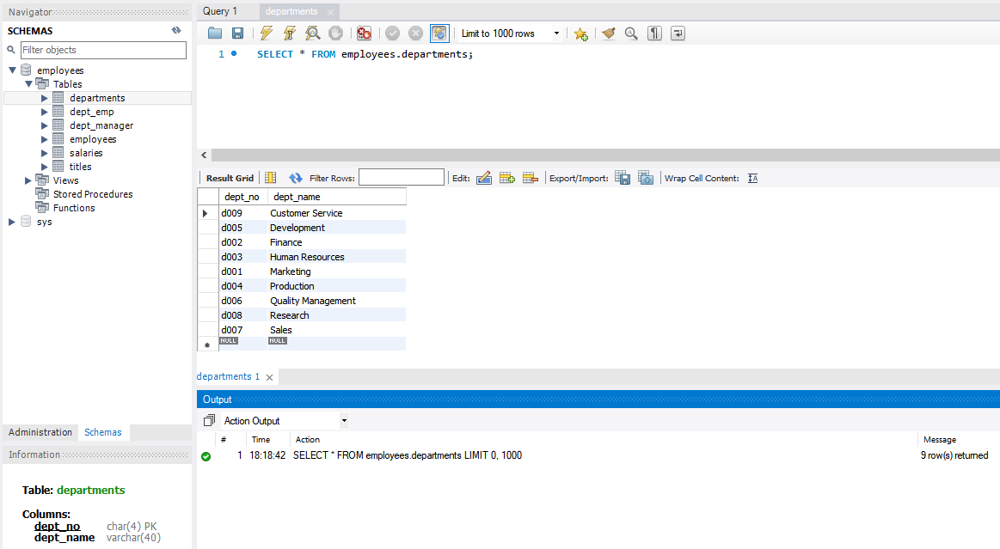

# CRUD com EF Core

[📽 Veja esta vídeo-aula no Youtube](https://youtu.be/tLkxJHqUDxk)

Este texto é continuação [desse](db-mysql.md).

## Entendendo o _scaffolding_

Foi criada uma classe com o contexto (`employeesContext.cs`), que fará o acesso ao banco.

Ela contém a string de conexão, em texto aberto, no método `OnConfiguring`. Há um _warning_ incluso, já que não é boa prática ter usuário e senha fixos dentro da aplicação. Por enquanto, certifique-se que a senha utilizada não é sensível (já que ela poderá subir ao GitHub, por exemplo), e remova a linha iniciada com `#warning`. Futuramente faremos uma segurança mais apurada.

Também foram criadas propriedades do tipo _DbSet_ para cada uma das suas tabelas, fazendo referência às classes com a estrutura da tabela, que estão nos demais arquivos criados.

No método `OnModelCreating` está definida toda a estrutura da tabela, baseada nos scripts DML (como `CREATE TABLE`, por exemplo).

As classes com as estruturas das tabelas (como `Departments.cs`) permitem verificar os tipos de dados e os relacionamentos de cada tabelas.

Agora, podemos usar os DbSets e as classes das tabelas para manipular nosso banco de dados.

## Usando o `DbContext`

Todo comando que acesse banco deve usar o contexto criado. Para isso, envolvemos o comando no bloco `using`, que garante que a conexão será aberta, e fechada quando não for mais necessária.

```cs
using (var db = new employeesContext())
{
    // o objeto db agora dá acesso ao contexto employeesContext
}
```

Perceba que podemos renomear `db` como quisermos (é comum usar `context`, por exemplo). O nome da classe de contexto deve ser o nome da classe criada pelo _scaffolding_.

Para usar o contexto, temos que adicionar referência a ele.

```cs
using nomeDoProjeto.nomeDaPastaUsadaNoScaffolding;
```

## Iterando todos os registros de uma tabela

Podemos, por exemplo, exibir todos os registros de uma tabela, iterando com `foreach`.

```cs
// ...
using ExemploEF.db;
// ...
using (var db = new employeesContext())
{
    // Para cada registro na tabela Departments
    foreach (var dep in db.Departments)
    {
        Console.WriteLine($"O departamento {dep.DeptNo} se chama {dep.DeptName}.");
    }
}
// ...
```

Dados cadastrados:



Saída:

```
C:\Users\ermog\Documents\code\DevWeb\ExemploEF>dotnet run
O departamento d009 se chama Customer Service.
O departamento d005 se chama Development.
O departamento d002 se chama Finance.
O departamento d003 se chama Human Resources.
O departamento d001 se chama Marketing.
O departamento d004 se chama Production.
O departamento d006 se chama Quality Management.
O departamento d008 se chama Research.
O departamento d007 se chama Sales.
```

## Usando Linq

Ao fazer referência à `System.Linq`, podemos usar seus métodos pra manipular os resultados. Serão criados os scripts `DQL` adequados (`SELECT`, `WHERE`, `ORDER BY`, etc.).

Você pode utilizar `OrderBy` para ordenar os registros:

```cs
foreach (var dep in db.Departments.OrderBy(d => d.DeptNo))
{
    Console.WriteLine($"O departamento {dep.DeptNo} se chama {dep.DeptName}.");
}
```

Saída:

```
C:\Users\ermog\Documents\code\DevWeb\ExemploEF>dotnet run 
O departamento d001 se chama Marketing.
O departamento d002 se chama Finance.
O departamento d003 se chama Human Resources.
O departamento d004 se chama Production.
O departamento d005 se chama Development.
O departamento d006 se chama Quality Management.
O departamento d007 se chama Sales.
O departamento d008 se chama Research.
O departamento d009 se chama Customer Service.
```

Também  pode usar `Where` para filtrar.

```cs
foreach (var dep in db.Departments.Where(d => d.DeptName.Contains("ment")))
{
    Console.WriteLine($"O departamento {dep.DeptNo} se chama {dep.DeptName}.");
}
```

Saída:

```
C:\Users\ermog\Documents\code\DevWeb\ExemploEF>dotnet run 
O departamento d005 se chama Development.
O departamento d006 se chama Quality Management.
```

Para obter um só registro, em uma busca por chave, por exemplo, use `SingleOrDefault`. Caso não encontrado, o resultado será `null`.

```cs
var dep = db.Departments.SingleOrDefault(d => d.DeptNo == "d005");
if (dep != null)
{
    Console.WriteLine($"O departamento {dep.DeptNo} se chama {dep.DeptName}.");
}
else
{
    Console.WriteLine("Departamento não encontrado.");
}
```

Também podemos buscar pela chave primária usando `Find`:

```cs
var dep = db.Departments.Find("d005");
if (dep != null)
{
    Console.WriteLine($"O departamento {dep.DeptNo} se chama {dep.DeptName}.");
}
else
{
    Console.WriteLine("Departamento não encontrado.");
}
```

## Inserindo linhas

Crie uma instância da classe da tabela desejada, e adicione no DbSet. Quando todas as alterações desejadas estiverem feitas, use o método `SaveChanges` do contexto.

```cs
var novoDepto = new Departments
{
    DeptNo = "n001",
    DeptName = "Almoxarifado",
};
db.Departments.Add(novoDepto);
db.SaveChanges();
```

## Alterando uma linha

Altere os valores da linha normalmente, e chame `SaveChanges`.

```cs
var dep = db.Departments.SingleOrDefault(d => d.DeptNo == "n001");
if (dep != null)
{
    dep.DeptName = "Novo nome do Almoxarifado";
    db.SaveChanges();
}
```

## Excluindo uma linha

Use `Remove` e chame `SaveChanges`.

```cs
var dep = db.Departments.SingleOrDefault(d => d.DeptNo == "n001");
if (dep != null)
{
    db.Departments.Remove(dep);
    db.SaveChanges();
}
```
